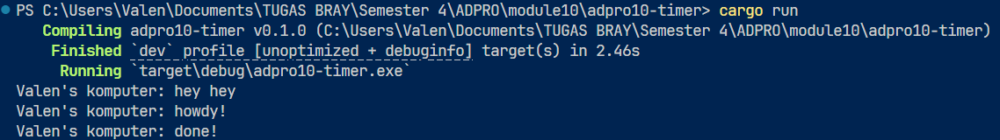

### 1.2 Understand How It Works

Fungsi async berjalan di background tanpa menghentikan eksekusi thread utama. Artinya, thread utama langsung melanjutkan ke baris kode berikutnya tanpa harus menunggu async selesai. Meski dijalankan sesuai urutan pemanggilan, fungsi async tidak menghambat alur utama. Itulah sebabnya "hey hey" muncul lebih dulu daripada "Howdy" dan "Done". Saat spawner di-drop, itu menandakan bahwa seluruh program telah selesai dieksekusi.