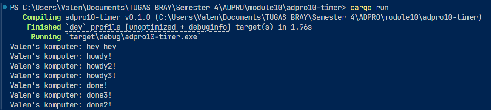

### 1.2 Understand How It Works

Fungsi async berjalan di background tanpa menghentikan eksekusi thread utama. Artinya, thread utama langsung melanjutkan ke baris kode berikutnya tanpa harus menunggu async selesai. Meski dijalankan sesuai urutan pemanggilan, fungsi async tidak menghambat alur utama. Itulah sebabnya "hey hey" muncul lebih dulu daripada "Howdy" dan "Done". Saat spawner di-drop, itu menandakan bahwa seluruh program telah selesai dieksekusi.

### 1.2  Multiple Spawn and removing drop

Tanpa pemanggilan drop.spawner(), program akan menganggap masih ada proses yang belum tuntas, sehingga terus berjalan dan tidak akan berhenti secara otomatis. Walaupun menggunakan multithreading, eksekusi tetap mengikuti urutan logika yang telah ditentukan. Karena "hey hey" ditulis di luar blok async, ia langsung dijalankan lebih dulu sebelum bagian async menyelesaikan tugasnya.